# 1. 主线
以CAE领域的场景，自底向上实现功能、优化、接口。

三层架构
1. Operation层 -> 在Operation层，根据业务需求调用可视化接口。
2. RPI (Render Pipeline Interface) 面向CAE场景的可视化层，负责各类HighLevel工具接口封装、渲染管线。
3. RHI 驱动层，基于Filament RHI, 轻度修改适配。

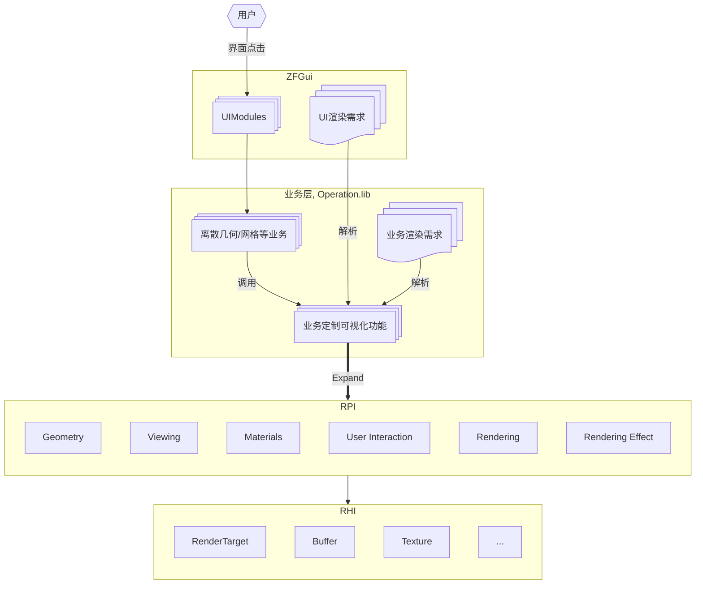


# 2. 目录分类
一级目录：功能大类，偏向于综合模块划分，结合顶层UI用户和开发者理解的划分方式
- [Geometry](#Geometry) //TODO：这里Link 到Geometry一级章节
- Viewing  //TODO：同上
- Materials  //TODO：同上
- User Interaction  //TODO：同上
- Rendering
- Renedring Effects


# 3. 功能组件文档章节框架
1. [目的]
2. [如何使用]，flowchart + sample/face code
3. [性能保证], 可能性以及处理方式
   1. [推荐做法]
   2. [退化做法]
4. [实现细节]内部工作细节流程，业务层不关心此部分。


# 4. Geometry

## 4.1. Entity 体系
一个3D场景下可被渲染处理的几何网格对象

- 支持自定义继承拓展
	```text
	# 该部分属于业务定制Entity
	Entity //基类
	├─ VirtualFaceEntity 
	├─ ShellEntiy
	├─ SegmentEntity
	├─ Grid1DEntity
	├─ Grid2DEntity
	├─ Grid3DEntity
	└─ ...
	```

- 预设几何对象
	- 简化业务层使用
	- 可视化对其有特定的性能优化，如减少内存损耗或者增加CPU缓存命中率等。

	```text
	Entity //基类
	├─ TriangleEntity //点+线+三角面的常规几何体，如Hoops的Shell。
	├─ QuadEntity 	  //单一四边形单元的几何体，如Hoops的Mesh。
	├─ PolygonEntity  //单一多边形或者混合多边形
	└─ ...		      //视情况，后续有优化空间再继承拓展
	```


## 4.2. 数据映射层 (Mapper)
映射CAE数据对象-->Entity可视化对象。
> 类似`vtkDataObject -> vtkAlgorithm -> vtkMapper -> vtkActor/vtkVolume`

//TODO: 这里需要一个我们自己的Mapper UML mermaid，以下为vtk的Mapper参考
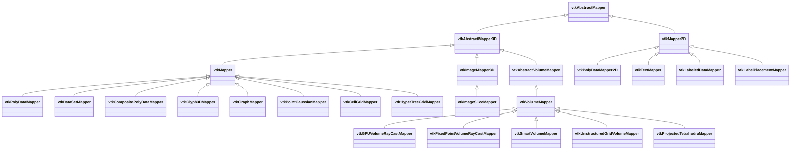
//TODO：vtk中对 CAE 可视化最常用的 mapper 包括：
- `vtkPolyDataMapper` #   用于表面几何、边线和点集显示。
- `vtkDataSetMapper` #   用于更通用的数据集输入场景。
- `vtkCompositePolyDataMapper` # 用于多块 polygonal 数据的组织和显示。  
- `vtkGlyph3DMapper` # 用于向量箭头、点符号和批量实例化 glyph。
- `vtkImageSliceMapper` #  用于二维切片显示。
- `vtkGPUVolumeRayCastMapper` # 用于规则体数据的 GPU 体渲染。
- `vtkUnstructuredGridVolumeMapper`。 # 用于非结构体网格的体渲染。

### 4.2.1. CAE DataType
//TODO: Operation层的DataType

### 4.2.2. 映射过程
//TODO：这里列出如何把单一多边形几何，混合多边形几何，..., 组装成 子类`Entity`。
类似如下，并附上伪代码或者flowchart
```
vtkUnstructuredGrid
-> vtkDataSetSurfaceFilter / vtkGeometryFilter
-> vtkPolyData
-> vtkPolyDataMapper
-> vtkActor
```
```text
vtkStructuredGrid
-> geometry/surface extraction
-> vtkPolyData
-> vtkPolyDataMapper
-> vtkActor
```

### 4.2.3. LOD 创建

### Geometry Properties
- 设置面颜色

## 4.3. 场景组织
使用SceneGraph组织

//TODO:这个图晚点修正
```text
Scene
└─ View
   ├─ Camera
   └─ Group 	#HPS::SegmentKey, vsg::Group
      │  ├─ Assembly / Block / Region 装配树 ## HPS::SubSegment, vsg::Group， 对应vtk中多个vtkActor
      │  │  │  ├─ Representation # vsg::StateGroup, //TODO:HPS对应是什么
      │  │  │  │  ├─ Geometry # vsg::Geometry
      │  │  │  │  ├─ ResultData
      │  │  │  │  ├─ DisplayStyle
      │  │  │  │  ├─ Transform
      │  │  │  │  └─ SelectionId / Metadata
```

- `Layer / Domain` 用于区分模型、网格、结果场、标注和辅助几何等不同显示域。
- `Assembly / Block / Region / Part / Instance` 对应 CAE 开发者真正关心的装配树、部件树、区域树和实例层次。
- `Representation` 表示直接切换的显示形态，如 surface、edge、point、volume、glyph、text、image。
- `Geometry`、`ResultData`、`DisplayStyle`、`Transform` 和 `SelectionId / Metadata` 是三类引擎中都稳定存在、且会直接暴露给 CAE 开发者操作的数据。


# 5. Viewing

## 5.1. View Hierarchy
> From Hoops `https://docs.techsoft3d.com/hps/2025.5.0/prog_guide/0301_core.html`

呈现一个有组织的画面层级，`View`维护自己的相机、可见性、裁剪、显示模式与绘制优先级。

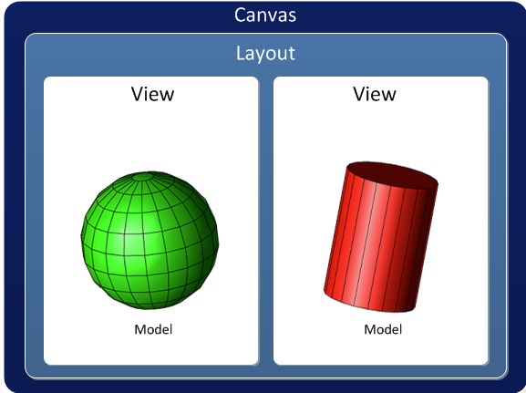


### 5.1.1. 组合示例
```c++
HPS::Canvas canvas = HPS::Factory::CreateCanvas(windowKey);
HPS::Layout layout = HPS::Factory::CreateLayout();
canvas.AttachLayout(layout);

HPS::View view1 = HPS::Factory::CreateView();
HPS::View view2 = HPS::Factory::CreateView();
layout.AttachViewFront(view1, HPS::Rectangle(-1, 0, -1, 1)); // left view
layout.AttachViewFront(view2, HPS::Rectangle(0, 1, -1, 1)); // right view

HPS::Model model = HPS::Factory::CreateModel();
HPS::SegmentKey modelSegmentKey = model.GetSegmentKey();
HPS::ShellKey shellKey = modelSegmentKey.InsertShell(myShellKit);//塞入三角网格

view1.AttachModel(model);
view2.AttachModel(model);
```

### 5.1.2. 画面更新怎么做
//TODO::Hoops中，如果需要更新画面了，接口怎么调用，c++接口代码或者伪代码
```c++
// 更新几何数据
modelSegment.Flush();
modelSegment.InsertShell(CreateShellKit(mesh));
// 只刷新受影响的 view
view.Update();
// 如需立即提交到窗口，再触发 canvas 级刷新
canvas.Update();
//比如相机数据更新
HPS::CameraKit camera;
view.ShowCamera(camera);
camera.SetPosition(HPS::Point(0, 0, 100));
view.SetCamera(camera);

view.Update();
canvas.Update();
```

### 5.1.3. 性能优化
View Hierarchy模块在Fixed Framerate需要做的
- 画面更新分层组装，避免整个窗口全量重建，`Canvas 窗口级刷新 -> Layout多视口分区 -> View 显示状态-> Model模型`，只重绘脏掉的 view、只更新受影响的子区域。
- 在预算快耗尽时优先提交各个 view 的基础结果，延帧绘制高耗时渲染任务。
- View之间共享model层数据。


## 5.2. 坐标系
> https://docs.techsoft3d.com/hoops/visualize-desktop/prog_guide/0302_coordinate_systems.html#
- 模型空间
- 世界空间
- 相机空间
- 像素空间
- 坐标转换

## 5.3. 相机(Camera) 
- 视锥体控制，正交透视， 近远平面自适应
- 相机姿态控制
- 相机轨道，环绕


## 5.4. 子窗口
> https://docs.techsoft3d.com/hoops/visualize-desktop/prog_guide/0304_subwindows.html#lightweight-subwindow-features-and-limitations
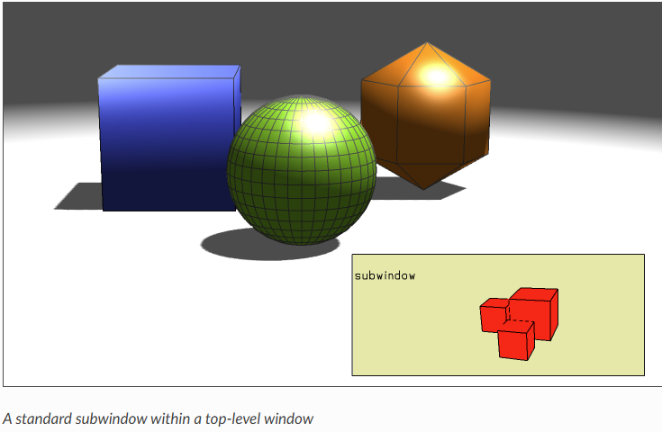

## 5.5. 裁切 (Clip Region)
效果描述：通过一个二维多边形的切割面把几何体切成两部分，分别控制两部分的可见性
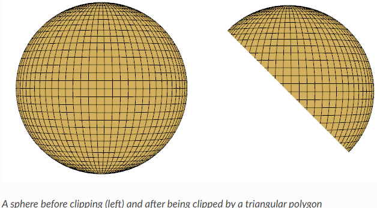

使用方式
```c++
//TODO:样例代码
```


## 5.6. 画面自适应 (AutoFit)
全局模型自动适应画面
> https://docs.techsoft3d.com/hps/2025.5.0/prog_guide/0301_core.html#fitworld


# 6. 共享资源池
> https://docs.techsoft3d.com/hoops/visualize-desktop/prog_guide/0401_portfolios_introduction.html

实现材质组合的复用，以key-value的形式查询使用

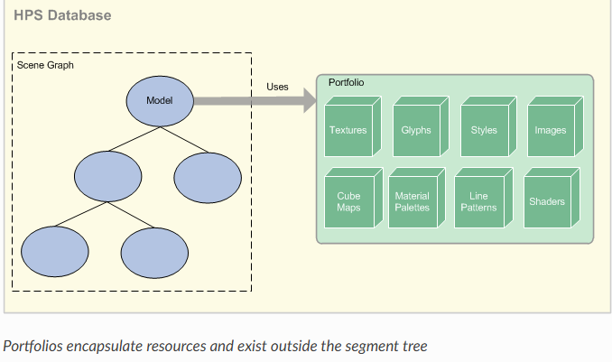

共享形式：//TODO
- Style: 在SceneGraph下，子树Root节点（StateGroup）的渲染状态，e.g. 设置颜色，边是否显示等.
- Glyph
- Line Pattern：

```c++
//使用代码
```

# 7. 材质 (Materials)
材质是一组用于装饰几何体的参数设置集合。材质由一系列渲染效果的组件构成。这些组件的例子包括漫反射通道、发光、凹凸、光泽度和透射。每个材质至少包含一个组件：基础颜色。
```c++
//创建一个材质Code
```

## 7.1. IO文件格式读取材质

## 7.2. Material Properties
- Hidden Line Removal

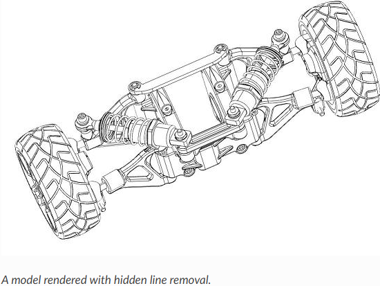

```c++
mySegmentKey.GetVisibilityControl().SetFaces(true).SetEdges(true).SetLines(true);
mySegmentKey.GetSubwindowControl().SetRenderingAlgorithm(HPS::Subwindow::RenderingAlgorithm::HiddenLine);
mySegmentKey.GetHiddenLineAttributeControl().SetVisibility(false);
```

- 透明

- Texturess
- Applying Material

- PBR
## 7.3. 材质数据流
//这里为材质内部数据流细节描述


# 8. User Interaction
> https://docs.techsoft3d.com/hoops/visualize-desktop/prog_guide/0601_standard_operators.html

使用一族pre-build小组件处理类似缩放、平移、旋转行为，也可以拓展能力实现自定义的操作目的，主要分为以下几类  
- Camera manipulation组件集合，内涵各种视角动作相关联的组件
- Selection组件集合
- Highlight组件集合
- 测量组件集合
- 杂项组件(Miscellaneous)
各个交互小组件需要考虑画面更新的策略

### 8.0.1. 核心结构
//Todo:以下为Hoops实例Operator UML, 替换成ZFGrid's 交互系统UML
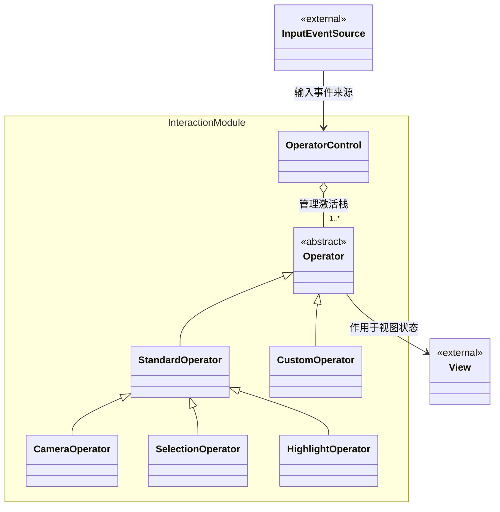

### 8.0.2. 运行流程
//Todo:以下为Hoops实例Operator Sequence, 替换成ZFGrid's 交互系统Sequence
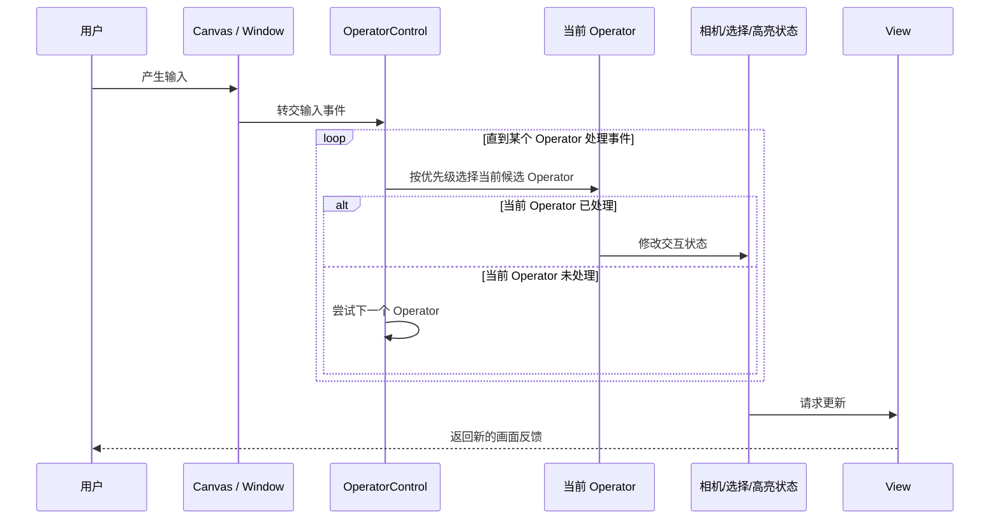

### 8.0.3. 交互拓展形式
//TODO: 换成ZFGrid的拓展形式
- 组合标准 Operator：直接 `Push/Set` 标准能力（Orbit/Pan/Zoom/Select/Highlight）。
- 继承 `Operator`：实现业务输入逻辑，返回 `true/false` 控制事件传播。
- 继承标准 Operator：复用已有行为，再补充你的业务动作。

### 8.0.4. 创建交互组件和使用示例
//TODO
```c++
auto oc = view.GetOperatorControl();
oc.UnsetEverything();
oc.Push(std::make_shared<HPS::PanOrbitZoomOperator>()); // 默认导航
oc.Push(std::make_shared<HPS::HighlightOperator>(
    HPS::MouseButtons::ButtonLeft(), HPS::ModifierKeys::KeyControl()),
    HPS::Operator::Priority::High); // Ctrl+左键高优先级高亮
```

## 8.1. 导航Cube(Axis Triad and Navigation Cube)
> https://docs.techsoft3d.com/hps/2025.5.0/prog_guide/0301_core.html#enabling-the-axis-triad-and-navigation-cube
右上角的方向导航方块

## 8.2. 选择模块
一个全局单例的选择系统，后台内置一个当前选中结果的全局状态机
//TODO: 待完善该章节

## 8.3. 高亮模块
- 高亮逻辑模块
//ToDO:基于ZFGrid完善当前接口文档


## 8.4. OverLay显示
> https://docs.techsoft3d.com/hoops/visualize-desktop/prog_guide/0605_overlays.html
属于将突出显示的几何独立绘制，避免全场景重绘。常见有以下三种模式：

| 始终穿透 | 带深度比较 | 半透明 Overlay |
| --- | --- | --- |
| 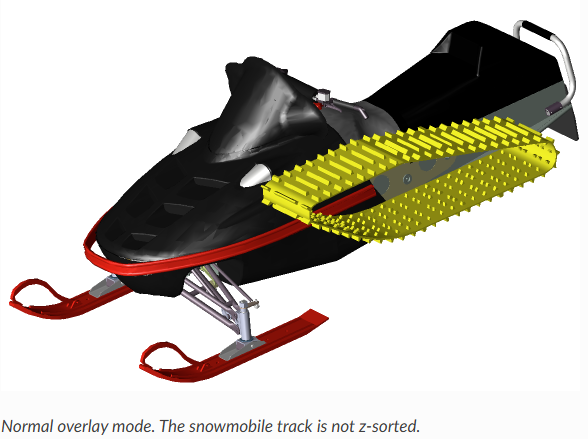 | 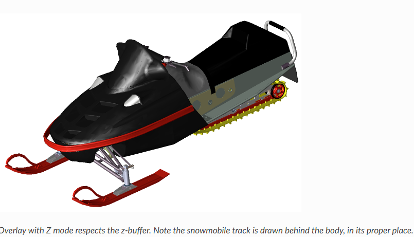 | 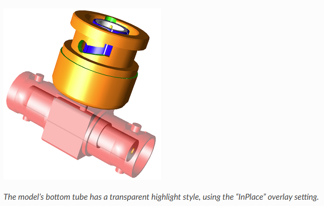 |
| 始终显示在最上层。 | 保留深度测试，更接近真实遮挡关系。 | 选中物体的同时，便于观察内部结构。 |


# 9. Rendering

## 9.1. 渲染管线
//TODO: OnGoing
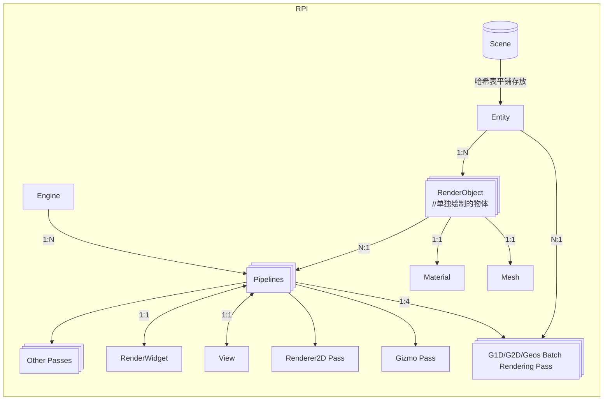

## 9.2. 画面更新
- View Hierarchy模块负责绘制更新
- User Interaction 的子模块各自负责画面刷新策略
- 画面更新结束信号
- 实例
```c++
myWindow.Update(); // 默认更新，是否全量重绘由系统内置逻辑控制
myWindow.Update(Window::UpdateType::Complete); //强制全量更新
myWindow.Update(Window::UpdateType::Default, 0.75);//控制重绘时间在0.75秒
```

## 9.3. 离屏绘制
- 窗口搭建
```c++
//TODO
//设置背景属性等接口调用例子
```

- Screeshot
保存画面到图片

# 10. Rendering Effect
> https://docs.techsoft3d.com/hoops/visualize-desktop/prog_guide/prog_guide_08_index.html

- Anti-Aliasing
- Shadow
  - Simple Shadow #投影到单一平面
  - Shadow Map
- Ambient Occlusion
- Reflection Planes
- Bloom
- 光照算法
  - Gouraud, Phong, Flat, Hemispheric Ambient Lighting


# 11. Performance Guarantee
## 11.1. Fixed Framerate
真正的 fixed framerate 策略最终由 Culling、LOD等多种系统共同完成

View方面：按优先级处理渲染任务，限制渲染管线运行上限时间。
- 主线程先保证交互和基础绘制按时提交，运动中优先显示低精度结果，静止后再补高精度
- 高成本工作如细化、排序、特效、缓存重建则放入后台队列
- 一旦接近本帧 deadline，就立即停止剩余工作并直接提交当前结果，下一帧再续做。
- 尽量复用上一帧可见集、裁剪结果和 GPU 资源，避免每帧全量重建

## 11.2. 裁剪系统
- SceneGraph 包围球 Frustum Culling
- //TODO:逐渐补充

# 12. 基础组件
- 内存分配器框架 <--- 隔离new delete和真正内存分配，内存分配器作为独立模块迭代，e.g. 延迟delete, 监控内存泄漏，环形缓冲、内存池、小对象优化，SoA、AoS排布支持
