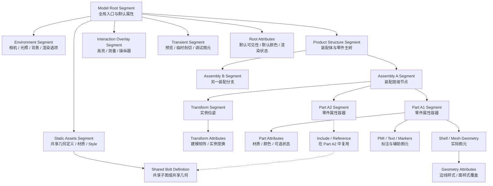

# 三维场景支持的所有Geometry种类
具备特定性能优化特点的，便于使用的常见几何体
Shells //三角网格+几何边界网格, 描述绝大部分的场景几何体。
Meshes //纯四边形网格
Text
Lights
Lines
Curves
Markers //3D单点标记
Polygons
Spheres
Cylinders 
NURBS 
Cutting sections
Grids //无限面积的交叉二维栅格网格
Reference geometry

## Shell
> https://docs.techsoft3d.com/hoops/visualize-desktop/prog_guide/0201_shells.html
场景中的一个带材质的物体，内部包含三角化Mesh, 边Mesh, 顶点Mesh

# 渲染技术
Anti-aliasing
Shadows
Reflection planes
Bloom
Lighting algorithms
Color interpolation
Hidden surface removal
Depth of field
Perimeter and silhouette edges
Custom shaders
Textures
Physically-based rendering (PBR)

# 交互 User Interaction
Mouse operators
Touch operators
3DConnexion SpaceMouse support
Selection
Highlighting
AR and VR support

# SDK WorkFlow
User Code change Graphics Database
finish make changes and signal update()
DataBase send primitive to Renderer, then output to device

# SceneGraph 架构
> https://docs.techsoft3d.com/hoops/visualize-desktop/prog_guide/0101_database.html#segments

常见的 SceneGraph 场景组织可以用下面的 `mermaid` 图表示：


- `Model Root Segment`：整个模型数据库的根节点，负责统一遍历入口和默认属性继承。
- `Environment Segment`：集中管理相机、光照、背景和渲染参数，适合作为全局状态层。
- `Static Assets Segment`：保存可复用的几何和样式定义，供多个业务节点通过 include/reference 共享。
- `Product Structure Segment`：承载装配体、子装配体、零件等业务层级，是大多数 CAD 场景的主体结构。
- `Transform Segment`：隔离实例变换，使“同一份几何，多处放置”更高效。
- `Part Segment`：作为零件级属性容器，用来挂接可见性、材质覆写、选择性等状态。
- Geometry / PMI 节点：放真正的 mesh、shell、文本、标记等内容，通常不直接承担大规模状态组织职责。
- `Interaction Overlay Segment` 与 `Transient Segment`：把交互层和高频变化内容与静态模型分离，减少局部更新对主场景的影响。
- 虚线 `Include / Reference`：表示 SceneGraph 在工程实践里往往不是纯树，而是带共享子图的 DAG。

HOOPS Visualize 的 SceneGraph 本质上是一个以 Segment 为核心的 retained-mode 层次数据库。Segment 既是组织节点，也是状态节点；它既能包含子 segment、几何、include/reference 关系，也能承载渲染和交互所需的大部分属性。


## SceneGraph 的核心组织方式
- `Segment`：场景树/DAG 的基本单元，负责层级组织、属性继承和局部更新。
- Geometry keys：真正的几何实体，例如 shell、line、mesh、text、light 等，通常挂在某个 segment 下。
- Include / Reference：用于复用已有场景片段或几何定义，把树状结构扩展成可共享的 DAG。
- KeyPath：描述某个对象在实例化后的真实访问路径，是选择、定位和高亮的重要基础。

## SceneGraph 的 Attribute 节点
`Attribute` 用于描述绘制状态，本身不对应独立几何命令，而是在遍历阶段与几何共同决定最终 draw call。`SegmentKey` 是属性的主要承载节点，属性沿 `Segment` 路径继承、覆盖并合成为当前几何的 net attributes，再映射为 shader、uniform、纹理、buffer 与 GPU pipeline state。
渲染遍历时，geometry key 定义“绘制什么”，`SegmentKey` 链上的 attributes 定义“以什么状态绘制”。常见属性包括材质、颜色、线型、可见性、透明度、变换、裁剪以及选择/高亮状态。HOOPS 因此以 segment 为中心组织状态，并通过提升 attribute coherence 来减少 traversal 与 GPU state switching。

```text
Model
└─ SegmentKey(root)
   ├─ Attribute: visibility
   ├─ Attribute: color
   ├─ SegmentKey(part_A)
   │  ├─ Attribute: transform
   │  ├─ Attribute: material
   │  └─ GeometryKey: shell
   └─ SegmentKey(part_B)
      ├─ Attribute: line pattern
      └─ GeometryKey: polyline
```
下面这个例子可以直接对应到 `samples/code/cpp/samples/segment_attributes.cpp`、`reference_geometry.cpp` 与 `conditional_styles_and_includes.cpp` 里常见的组织方式：先在上游 segment 放默认 attribute，再在实例段局部覆盖，最后把几何或 include 落到叶子节点。

```text
Model
└─ SegmentKey(root)
   ├─ Attribute: visibility = on
   ├─ Attribute: material diffuse = grey
   ├─ Attribute: rendering mode = phong
   ├─ SegmentKey(definitions)
   │  └─ SegmentKey(bolt_def)
   │     ├─ Attribute: color = steel
   │     ├─ Attribute: edge visibility = off
   │     └─ GeometryKey: shell(bolt)
   ├─ SegmentKey(assembly_A)
   │  ├─ Attribute: transform = T_A
   │  ├─ Attribute: color = red              <- 覆盖 root/default color
   │  ├─ Include: definitions/bolt_def
   │  └─ SegmentKey(callout)
   │     ├─ Attribute: overlay = default
   │     └─ GeometryKey: text("A1")
   └─ SegmentKey(assembly_B)
      ├─ Attribute: transform = T_B
      ├─ Attribute: transparency = 0.35
      ├─ Attribute: line pattern = dashed
      └─ Include: definitions/bolt_def
```

从上游到下游看，`root -> assembly_X -> bolt_def -> shell` 这条路径共同决定最终的 net attributes：

- `root` 给出全局默认状态，比如材质、显示模式、可见性。
- `assembly_A` / `assembly_B` 只改实例相关 attribute，比如变换、颜色、透明度。
- `bolt_def` 保存可复用的“定义段”，承载几何本体和该零件自己的默认外观。
- 到 `shell(bolt)` 真正发出 draw 时，Renderer 才把整条 KeyPath 上的 attribute 合成。

可以把典型调用顺序理解成下面这样：

```cpp
auto root = HPS::Database::CreateRootSegment();
root.GetVisibilityControl().SetEverything(true);
root.GetMaterialMappingControl().SetFaceColor(HPS::RGBAColor(0.7f, 0.7f, 0.7f));

auto definitions = root.Subsegment("definitions");
auto bolt_def = definitions.Subsegment("bolt_def");
bolt_def.GetMaterialMappingControl().SetFaceColor(HPS::RGBAColor::SteelGray());
bolt_def.GetVisibilityControl().SetEdges(false);
bolt_def.InsertShell(...);

auto assembly_A = root.Subsegment("assembly_A");
assembly_A.GetModellingMatrixControl().SetNetModellingMatrix(T_A);
assembly_A.GetMaterialMappingControl().SetFaceColor(HPS::RGBAColor::Red());
assembly_A.IncludeSegment(bolt_def);

auto assembly_B = root.Subsegment("assembly_B");
assembly_B.GetModellingMatrixControl().SetNetModellingMatrix(T_B);
assembly_B.GetRenderingOptionsControl().SetTransparency(0.35f);
assembly_B.GetLineAttributeControl().SetPattern(HPS::LinePattern::Dashed);
assembly_B.IncludeSegment(bolt_def);
```

这个例子里最关键的是 Attribute 的“上下游分工”：

- 上游公共段放稳定默认值，减少重复设置。
- 中游实例段只放每个实例不同的状态，适合 `IncludeSegment()` 复用。
- 下游定义段贴近几何，保存零件固有外观。
- 选择、高亮、conditional style 本质上也是沿 KeyPath 叠加到这条 attribute 链上的附加状态。


## 数据流视角
1. 应用修改 `Segment`、几何或属性。
2. Database 保留变化后的结构与状态，而不是立即丢弃。
3. 渲染遍历时沿 `Segment` 路径解析 include/reference，并计算 net attributes。
4. Renderer 只重绘受影响的部分，把最终 primitive 和状态提交到 GPU。

## 对性能的直接启示
- 优先按属性一致性组织 segment，而不是按业务对象机械一一对应。
- 复用共享结构时优先使用 include/reference，减少重复几何和重复状态。
- 把频繁变化的节点与静态节点分层，降低局部更新的传播范围。
- 把选择、高亮、裁剪等横切能力建立在 scene graph 路径上，而不是散落在几何对象上。

# 文件IO
CAD Files with Sprocket HOOPS Exchange
PDF and HTML with Sprocket HOOPS Publish
DWG/DXF with Sprocket RealDWG
Parasolid with Sprocket Parasolid
SKP with Sprocket Sketchup
Point clouds


# HPS::TreeContext
> 加速结构上下文通用结构

# Retained Mode
保留所有的Primitive信息，方便做算法优化

只更新变化的部分，画面，几何数据
包围盒系统裁剪，根据：屏幕上可见的、用户指定尺寸限制、需要redraw的重要程度。

# 管线优化
array-based 数据结构，增加缓存命中
线程安全的内存管理和分配，空闲时间的内存回收清理
着色器代码优化

**CPU和GPU VertexBuffer数据镜像，确保显存有余量，不至于驱动使用主存**
> HOOPS Visualize Desktop automatically creates and manages vertex buffers on the graphics card, mirroring the geometry data on the CPU. HOOPS Visualize Desktop works to ensure graphics card memory is not exhausted, which would otherwise cause the graphics driver to page main memory resulting in a catastrophic slowdown.

# 场景优化
### 核心观点：
- GPU上下文切换的成本，会随着场景变大而恶化，
- 只画最关键的数据，而不是所有的数据。
### 提到的技术做法：
- 良好的Scene组织加速Culling
- culling: backplane, view frustum and extent culling
- 设立**Static Model**概念，表示由App创建的原始结构，Scene Graph负责对Static Model的自动优化。

# 固定帧率
- 提供接口，实现根据当前相机参数，按照优先级，绘制整个场景。
- 优先级定义：Object在屏幕中的尺寸，与观察者之间的距离。
- 旋转的时候，减少细节绘制，更多关注在旋转响应上。
- 低帧率如何处理：当一帧时间超过了交互响应帧率时间，就中断渲染过程，立刻开始下一帧绘制，当Navigation停止的时候，继续从中断点继续，完成剩余绘制。

# HOOPS Visualize 官方文档深度调研（2026-03-18）

> 本节基于两类证据整理：
> 1. 官方文档：Programming Guide、Technical Overview、Static Model Guide、Selection/Highlighting Guide、API Conventions
> 2. 官方示例：`D:\github-repos\RoadMap2026\HOOPS_Visualize_2026.1.0\HOOPS_Visualize_2026.1.0\samples`
>
> 本节重点回答两个问题：
> - HOOPS Visualize 的功能如何分组，接口风格是什么，典型接口怎么用
> - 性能优化如何工作，Scene Graph 的完整设计、数据结构、数据流是什么

## 一、功能分类总览

从官方文档和样例的组织方式看，HOOPS Visualize Desktop 可以按下面几类理解：

| 类别 | 核心对象/接口 | 作用 | 典型样例 |
|---|---|---|---|
| 数据库与 Scene Graph | `World`、`SegmentKey`、`KeyPath`、`SearchResults` | 建立/组织 retained scene graph，完成层级、实例化、检索、路径定位 | `database_search.cpp`、`segment_attributes.cpp`、`reference_geometry.cpp` |
| 视图与显示系统 | `WindowKey`、`Canvas`、`Layout`、`View`、`Model` | 组织窗口、视图、图层、相机、渲染模式 | `sample.cpp`、`qt_quick_sandbox/quickcanvas.cpp`、`openvr_sandbox/main.cpp` |
| 几何与属性 | `InsertShell`、`InsertText`、`InsertLight`、各种 `*Control` / `*Kit` | 定义图元、材质、可见性、透明、矩阵、裁剪等 | `insert_cube.cpp`、`segment_attributes.cpp`、`hidden_line_advanced.cpp` |
| 样式/资源库/条件 | `PortfolioKey`、`DefineNamedStyle`、`DefineGlyph`、`ConditionalExpression` | 定义样式资源、条件样式、条件 include | `selection.cpp`、`conditional_styles_and_includes.cpp` |
| 交互、选择、高亮 | `SelectionControl`、`HighlightControl`、`SelectionOptionsKit`、`Operator` | 点选/框选/路径高亮/操作器驱动交互 | `selection.cpp`、`select_by_point.cpp`、`operators/*` |
| 导入导出与 CAD 集成 | `Stream::File::Import`、`Exchange::File::Import`、`Hardcopy::File::Export`、`Image::File::Export` | HSF/STL/OBJ/点云/CAD 导入、PDF/图片导出 | `database_search.cpp`、`quickcanvas.cpp`、`exchange_*` |
| 性能与调试 | `PerformanceControl`、`CullingControl`、`Canvas.SetFrameRate`、`DebuggingControl` | display list、static model、culling、fixed framerate、resource monitor | `openvr_sandbox/main.cpp`、`mfc_ooc_sandbox/CHPSDoc.cpp`、`qt_quick_sandbox/quickcanvas.cpp` |
| 大模型/流式/OOC | `OOC::*`、`SetDeferralExtent`、区域跟踪器 | 大模型延迟绘制、区域加载、按优先级渲染 | `mfc_ooc_sandbox/*` |

### 1. 数据库 / Scene Graph 类

这是 HOOPS Visualize 的根。官方文档明确说，虽然它叫 “database”，但它不是 SQL 式关系数据库，而是一个 tree-like 的 scene graph。节点叫 `Segment`，`Segment` 既装几何，也装属性，还负责父子层次、include、reference、条件等关系。

最关键的能力包括：

- 用 `Database::CreateRootSegment()` 建独立根段
- 用 `SegmentKey::Subsegment()` 建子段
- 用 `IncludeSegment()` 做“整段实例化”
- 用 `ReferenceGeometry()` 做“纯几何实例化”
- 用 `Find()` / `SearchResults` / `SearchResultsIterator` 做数据库检索
- 用 `KeyPath` 精确描述某个实例在 DAG 中的真实路径

对应样例：

- `samples/code/cpp/samples/database_search.cpp`
- `samples/code/cpp/samples/segment_attributes.cpp`
- `samples/code/cpp/samples/reference_geometry.cpp`
- `samples/code/cpp/samples/conditional_styles_and_includes.cpp`

### 2. 视图与显示系统类

这部分负责“看”。官方 API 把显示链拆成 `Window -> Canvas -> Layout -> View -> Model`。

典型职责：

- `WindowKey`：窗口、驱动、更新、高亮控制、调试信息
- `Canvas`：承载 layout/view，转发输入事件，设置固定帧率
- `Layout`：多视图/多 layer 组织
- `View`：相机、渲染模式、操作器栈、附加模型
- `Model`：场景数据根、库根、portfolio

对应样例：

- `samples/code/cpp/sample.cpp`
- `samples/qt_quick_sandbox/quickcanvas.cpp`
- `samples/openvr_sandbox/main.cpp`
- `samples/wpf_sandbox/source/SegmentBrowser/SegmentBrowser.cs`

### 3. 几何与属性类

HOOPS 的几何插入全部围绕 `SegmentKey` 展开，插入后返回相应 `Key`。属性大部分不直接挂在 geometry 上，而是挂在 segment 上，通过继承向下传播。

主要能力：

- 插入几何：`InsertShell`、`InsertText`、`InsertMarker`、`InsertDistantLight` 等
- 修改属性：`GetMaterialMappingControl()`、`GetVisibilityControl()`、`GetTransparencyControl()`、`GetCullingControl()`、`GetModellingMatrixControl()` 等
- 用 `*Kit` 批量构造或批量提交状态

对应样例：

- `samples/code/cpp/samples/insert_cube.cpp`
- `samples/code/cpp/samples/segment_attributes.cpp`
- `samples/code/cpp/samples/hidden_line_advanced.cpp`

### 4. 样式 / 资源库 / 条件类

HOOPS 的 style 不是零散属性集合，而是通过 `Portfolio` 管理的一等公民资源系统。glyph、texture、line pattern、named style 都在 portfolio 里定义，然后由 segment 或 window 使用。

主要能力：

- `PortfolioKey::DefineNamedStyle`
- `PortfolioKey::DefineGlyph`
- 条件样式：`PushNamed("style", ConditionalExpression(...))`
- 条件 include：`IncludeSegment(seg, condition)`

对应样例：

- `samples/code/cpp/samples/selection.cpp`
- `samples/code/cpp/samples/conditional_styles_and_includes.cpp`
- `samples/operators/sprk_exchange_common_measurement_op.cpp`

### 5. 交互、选择、高亮类

HOOPS 把“选择”和“高亮”明确分开。选择返回 `SelectionResults`，高亮由 `HighlightControl` 执行，且支持 overlay 优化。

主要能力：

- `WindowKey.GetSelectionControl().SelectByPoint/Area/...`
- `SelectionOptionsKit` 控制 level、algorithm、proximity、sorting
- `SelectionItem.ShowPath(selectionPath)` 拿到精确命中的 `KeyPath`
- `WindowKey.GetHighlightControl().Highlight(path, options)` 执行高亮
- `Operator` / `HighlightOperator` / `SelectOperator` 驱动交互

对应样例：

- `samples/code/cpp/samples/selection.cpp`
- `samples/code/cpp/samples/select_by_point.cpp`
- `samples/operators/*`

### 6. 导入导出与 CAD 集成类

HOOPS 不是只负责渲染，它把导入导出链做得很完整。导入通常是异步 notifier 风格，导出支持图片、PDF、HSF 等。

主要能力：

- `Stream::File::Import`：HSF 等通用流导入
- `Exchange::File::Import`：CAD 装配/PMI/BRep+tess
- `Hardcopy::File::Export`：PDF/Postscript
- `Image::File::Export`：PNG/JPEG

对应样例：

- `samples/qt_quick_sandbox/quickcanvas.cpp`
- `samples/code/cpp/samples/database_search.cpp`
- `samples/code/cpp/samples/exchange_*`

### 7. 性能、调试、大模型类

这是工程应用最关键的一块。HOOPS 的 retained mode、display list、static model、culling、fixed framerate、resource monitor 都是围绕大型工程模型的交互性能设计的。

主要能力：

- `GetPerformanceControl().SetDisplayLists(...)`
- `GetPerformanceControl().SetStaticModel(...)`
- `GetCullingControl().SetExtent()/SetDeferralExtent()/SetFrustum(...)`
- `Canvas.SetFrameRate(...)`
- `Window.GetDebuggingControl().SetResourceMonitor(true)`

对应样例：

- `samples/openvr_sandbox/main.cpp`
- `samples/vr_shared/vr.cpp`
- `samples/mfc_ooc_sandbox/CHPSDoc.cpp`
- `samples/qt_quick_sandbox/quickcanvas.cpp`
- `samples/operators/sprk_exchange_common_measurement_op.cpp`

## 二、接口风格总结：HOOPS 是什么样的 API

### 1. 典型风格：Key / Object / Control / Kit 四层

HOOPS 的接口不是传统的“单一大对象 + setter”，而是非常稳定的四层式风格：

1. `Object` / `Key`  
   `SegmentKey`、`ShellKey`、`TextKey`、`WindowKey` 是数据库对象的句柄。
2. `Control`  
   `GetCameraControl()`、`GetVisibilityControl()`、`GetPerformanceControl()` 这类接口负责对 compound attribute 做局部读写。
3. `Kit`  
   `CameraKit`、`SelectionOptionsKit`、`PerformanceKit`、`BoundingKit` 是脱离数据库的事务对象，用来批量配置或批量读回。
4. `Notifier / Event / Operator`  
   导入是 `Notifier`，交互是 `Operator`，系统通知是 `EventDispatcher`。

这是一个“工程可维护性优先”的 API 设计，不是游戏引擎式 ECS，也不是 immediate-mode OpenGL 式调用。

### 2. `Show / Set / Unset / Insert / Delete` 的命名规约非常统一

官方 API Conventions 明确总结了这套命名规则：

- `SetXxx`：设置局部值
- `UnsetXxx`：去掉局部值，恢复继承
- `ShowXxx`：查询局部值，通常返回 bool 表示本地是否设置
- `InsertXxx`：向数据库插入几何/对象
- `Delete`：删除数据库对象

这套命名规约很重要，因为你一看到 `GetVisibilityControl().ShowLines(state)`，就能知道它只是在查“本地是否设置”；如果想拿 net value，应该走 `KeyPath`。

### 3. `Control` 适合直接改数据库，`Kit` 适合事务式批量修改

示例：

```cpp
segment.GetMaterialMappingControl()
    .SetFaceColor(HPS::RGBAColor(1, 0, 0, 1))
    .SetEdgeColor(HPS::RGBAColor(0, 0, 1, 1));
```

这是直接写数据库，简单直接。

而下面这种更适合“先离线组装，再一次提交”：

```cpp
HPS::SelectionOptionsKit sok;
sok.SetLevel(HPS::Selection::Level::Entity)
   .SetAlgorithm(HPS::Selection::Algorithm::Analytic)
   .SetSorting(HPS::Selection::Sorting::Default);
```

`Kit` 的价值有两个：

- 可以链式调用，表达很紧凑
- 可以减少频繁 database read / write，把复杂配置先在内存里组装好

### 4. 方法链式调用是高频设计

HOOPS 非常强调 method chaining。几乎所有 `Set...` 都返回自身对象，这使得代码读起来像 DSL。

例如：

```cpp
view.GetSegmentKey()
    .GetTransparencyControl()
    .SetAlgorithm(Transparency::Algorithm::DepthPeeling)
    .SetDepthPeelingLayers(2)
    .SetMethod(Transparency::Method::Blended);
```

### 5. 异步导入 + 显式等待

导入不是同步阻塞 API，而是：

```cpp
HPS::Stream::ImportNotifier notifier =
    HPS::Stream::File::Import(filename, ioOpts);
notifier.Wait();
```

这说明 HOOPS 内部已经默认把耗时任务放进后台线程 / dispatcher，应用层只需要在必要时 `Wait()`。

### 6. 事件与交互是 View 维度的 Operator 栈

`View.GetOperatorControl().Push(...)` 是 HOOPS 的交互主线。鼠标/触摸/VR 交互本质上不是直接改 scene，而是把 operator 压到 view 上，让它消费事件并产出 selection / highlight / move / measure 行为。

这使得“显示系统”和“交互系统”解耦得很好。

## 三、接口使用：最标准的建场、实例化、选择、高亮、性能设置

### 1. 标准建场链路

`samples/code/cpp/sample.cpp` 展示了最标准的建场方式：

```cpp
StandAloneWindowKey wk = Database::CreateStandAloneWindow(wo);
Canvas canvas = Factory::CreateCanvas(wk);
View view = Factory::CreateView();
canvas.AttachViewAsLayout(view);
Model model = Factory::CreateModel();
view.AttachModel(model);
SegmentKey modelKey = model.GetSegmentKey();
```

这个链路非常关键，它说明：

- `Canvas` 挂 `Layout`
- `Layout` 挂 `View`
- `View` 挂 `Model`
- `Model` 的内容根是 `SegmentKey`

### 2. 整段实例化：`IncludeSegment`

`segment_attributes.cpp` 与官方 Database 文档都表明，`IncludeSegment` 是“整段引用”：

```cpp
SegmentKey includeLibrary = Database::CreateRootSegment();
SegmentKey cube = includeLibrary.Subsegment("cube");

SegmentKey box = modelKey.Subsegment("box");
box.IncludeSegment(cube);
```

特点：

- 引入整个 segment subtree
- 几何、子段、属性关系都会带进来
- 适合做装配级实例化、共享模型库、多窗口共享同一模型

### 3. 纯几何实例化：`ReferenceGeometry`

`reference_geometry.cpp` 对应官方 “Segment References”：

```cpp
ShellKey myShellKey = shellSegment.InsertShell(shellKit);
ReferenceKey refKey = refSegment.ReferenceGeometry(myShellKey);
refKey.SetModellingMatrix(myKit);
```

特点：

- 只引用 geometry，不带子段和属性
- 适合大量重复零件 / 重复网格
- 每个 reference 可以有独立变换

可以把它理解成：

- `IncludeSegment` 更像“实例化整个逻辑子树”
- `ReferenceGeometry` 更像“实例化几何 payload”

### 4. 条件样式与条件 include

`conditional_styles_and_includes.cpp` 非常能体现 HOOPS 的 declarative 风格：

```cpp
model1.GetStyleControl().PushNamed("wireframe", ConditionalExpression(b));
model1.GetStyleControl().PushNamed("phong", ConditionalExpression(t));
model1.IncludeSegment(model2, AND(ConditionalExpression(b), ConditionalExpression(r)));
```

然后在不同 subwindow 上设置不同 conditions：

```cpp
topLeft.SetConditions(c1);
topRight.SetConditions(c2);
bottomLeft.SetConditions(c3);
bottomRight.SetConditions(c4);
```

这说明 HOOPS 的 Scene Graph 不只是“树 + 属性继承”，它还是“树 + 条件求值 + 运行时展开”的结构。

### 5. 选择与高亮

`selection.cpp` 给了最标准的完整流程：

1. 用 portfolio 定义 highlight style
2. 构造 `KeyPath`
3. 把 world 坐标转成 window 坐标
4. `SelectByPoint`
5. 从 `SelectionItem` 取 `ShowPath`
6. 用 `HighlightControl.Highlight(path, options)` 高亮

核心代码形态：

```cpp
SelectionOptionsKit selectionOptions;
selectionOptions.SetLevel(Selection::Level::Entity)
                .SetRelatedLimit(0)
                .SetSorting(Selection::Sorting::Default);

wk.GetSelectionControl().SelectByPoint(selectionPosition, selectionOptions, selectionResults);

SelectionItem selection = it.GetItem();
selection.ShowPath(selectionPath);
wk.GetHighlightControl().Highlight(selectionPath, hok);
```

这里最重要的不是 `SelectByPoint`，而是 `KeyPath`。因为 include 导致同一 geometry 可能在 DAG 中出现多次，不带 path 就无法唯一定位“到底是哪一个实例被选中了”。

### 6. 性能设置

最典型的性能配置出现在 `openvr_sandbox/main.cpp`：

```cpp
model.GetSegmentKey()
    .GetPerformanceControl()
    .SetStaticModel(HPS::Performance::StaticModel::Attribute)
    .SetDisplayLists(HPS::Performance::DisplayLists::Segment);
```

这几乎就是 HOOPS 工程项目里的“常规高性能默认值”。

但 `sprk_exchange_common_measurement_op.cpp` 同时提醒了一个反例：

```cpp
measurement_segment.GetPerformanceControl().SetStaticModel(Performance::StaticModel::None);
```

也就是说：

- 静态大模型段，适合 `StaticModel`
- 高频动态 construction / measurement / overlay 段，不适合 `StaticModel`

## 四、Scene Graph 的完整设计：结构、数据结构、数据流

### 1. 承载层级：不是只有 Segment Tree，而是多层图形系统

从官方文档、`sample.cpp`、`SegmentBrowser.cs`、`sprk.h` 可以把 HOOPS 的完整承载层级画成这样：

```text
World
└─ WindowKey / OffScreenWindowKey / ApplicationWindowKey
   └─ Canvas
      └─ Layout
         └─ View
            ├─ View Segment
            │  ├─ Camera / Rendering Mode / Culling / VisualEffects
            │  └─ Model Override Segment
            └─ IncludeLink
               └─ Model
                  ├─ Model Segment (作者定义的外部场景树)
                  ├─ Library Segment (共享几何 / 辅助段 / alternate root)
                  └─ Portfolio (style / glyph / texture / material palette)
```

要点：

- 真正“承载业务场景”的主体是 `Model.GetSegmentKey()`
- `View` 通过 include link 挂载 `Model`
- `Canvas` 通过 layout 挂载 view
- `Window` 负责更新、选择、高亮、资源监控
- `Model.GetLibraryKey()` 是模型附属库，不直接等于显示树
- `Portfolio` 是资源 / 样式库，不是 segment 树节点本身

### 2. Scene Graph 的核心数据结构

#### 2.1 外部作者树（application-authored tree）

这是应用自己构建的树 / 图：

- 节点：`Segment`
- 子边：parent -> subsegment
- include 边：segment -> included segment
- reference 边：segment -> referenced geometry
- 条件边：include / style / reference 可以绑定 `ConditionalExpression`

所以它不是纯树，而是：

- 局部看是 segment tree
- 全局看是带 include / reference 的 DAG

#### 2.2 几何负载（geometry payload）

几何通常挂在 segment 下：

- `ShellKey`
- `MeshKey`
- `TextKey`
- `MarkerKey`
- `LineKey`
- `ReferenceKey`
- `DistantLightKey` / `SpotlightKey`

`wpf_sandbox` 的 `SceneTree.ItemType` 也印证了 runtime 可以把这些几何归到不同 group：

- `ShellGroup`
- `MeshGroup`
- `TextGroup`
- `ReferenceGroup`
- `DistantLightGroup`
- `SpotlightGroup`

#### 2.3 属性负载（attribute payload）

HOOPS 的属性不是随便散落在对象上的，而是强烈 segment-centric 的。`SceneTree.ItemType` 中能看到大量属性节点：

- `Material`
- `Camera`
- `ModellingMatrix`
- `TextureMatrix`
- `Culling`
- `Visibility`
- `Transparency`
- `VisualEffects`
- `Performance`
- `Bounding`
- `AttributeLock`
- `Priority`
- `Condition`

这说明从引擎内部视角看，segment 实际上是“几何容器 + 属性容器 + 关系容器”三合一。

#### 2.4 路径结构：`KeyPath`

`KeyPath` 是 HOOPS 里非常关键的数据结构。它不是普通 parent path，而是“在包含 include 的 DAG 中，从叶到根的无歧义链”。

典型构成：

```text
Leaf Geometry / Segment
-> IncludeLink(s)
-> Model / View / Layout include links
-> Window
```

官方 `SprocketPath` 的注释写得很清楚：它可以自动获得 “from the Model to the Canvas” 的 `KeyPath`。

### 3. 属性继承、覆盖、锁定、条件

这是 HOOPS Scene Graph 设计的核心机制。

#### 3.1 继承

属性默认向下继承。父 segment 设了材质 / 可见性 / 矩阵，子段默认拿 net value，除非本地覆盖。

#### 3.2 覆盖

子 segment 本地 `Set...` 就覆盖父级。

#### 3.3 回退

`Unset...` 不是“设为 false”，而是“删除本地定义，恢复继承”。

#### 3.4 锁定

`AttributeLock` 用于强制下层不能再改某些属性。`sprk_exchange_common_measurement_op.cpp` 里对 measurement segment 锁了 material，就是典型例子。

#### 3.5 条件

条件是 inherited attribute。条件一旦在上层 segment 设置，树下很多 conditional styles / includes 会同时生效。

这让 HOOPS 的 scene graph 具有了“声明式求值”的味道，不只是静态层级。

### 4. View-specific override：为什么 `GetModelOverrideSegmentKey()` 很重要

`View` 提供 `GetModelOverrideSegmentKey()`，`sprk.h` 注释明确写它是一个 override segment，用来施加 view 级别的覆盖而不破坏 model 级 static tree。

这在工程上非常关键：

- 如果你只是想在某个 view 里平移 / 缩放 / 隐藏模型
- 你不应该直接改模型根段
- 你应该改 view 的 override segment

`openvr_sandbox/main.cpp` 就是这么做的：

- 先 `vr_view.AttachModel(model)`
- 再在 `GetModelOverrideSegmentKey()` 上做居中、缩放、平移

这说明 HOOPS 很清楚地区分了：

- 数据本体：`Model`
- 观察方式：`View`
- 视图临时覆盖：`Model Override Segment`

### 5. Scene Graph 的完整数据流

#### 5.1 建模 / 导入流

```text
文件 / 应用数据
-> ImportOptionsKit / 手工构建
-> Model.GetSegmentKey() / Model.GetLibraryKey() / Model.GetPortfolioKey()
-> 建立 subsegments / includes / references / styles
-> View.AttachModel(model)
-> Canvas.AttachViewAsLayout(view)
-> Window.Update()
```

说明：

- 几何和装配主树通常进 `Model.GetSegmentKey()`
- 共享库 / 辅助结构可进 `Model.GetLibraryKey()`
- 样式资源进 `PortfolioKey`
- Exchange / Stream 导入时经常同时设置 `SetSegment + SetAlternateRoot + SetPortfolio`

#### 5.2 渲染流

```text
Window Update
-> Canvas / Layout / View 遍历
-> AttachModel include link 进入 Model
-> 遍历 Segment DAG
-> 解析 include / reference / condition / style / inheritance
-> 计算 net attributes + bounding
-> 进入 renderer
-> 生成 / 复用 display list / vertex buffers
-> 输出到 OpenGL / DirectX / Hardcopy / Image driver
```

如果启用了 static model，则中间会变成：

```text
Application-authored scene tree
-> Static model optimizer
-> 内部 optimized shadow tree
-> renderer 实际从 shadow tree 绘制
```

#### 5.3 交互流

```text
GUI / 鼠标 / 触摸 / VR 输入
-> Operator / 手工 SelectionControl
-> window-space 选择
-> SelectionResults
-> SelectionItem.ShowPath(KeyPath)
-> HighlightControl / 编辑 / 查询 / 删除 / 业务映射
```

#### 5.4 视图自适应流

```text
Scene / Segment / Bounding
-> ShowBounding / ComputeFitWorldCamera / FitWorld
-> CameraKit
-> View Camera 更新
```

`FitWorld` 和 `ShowBounding` 这条线说明 bounding 在 HOOPS 里不是附属物，而是整个相机适配、裁剪、fixed framerate 优先级计算的重要基础数据。

## 五、性能优化：HOOPS 是怎么做快的

### 1. Retained Mode 是一切性能设计的前提

官方 Technical Overview 把 retained mode 的收益说得很明确：

- selective traversal
- incremental updates
- view-dependent drawing and culling
- faster selection

这意味着 HOOPS 不是每帧让应用重发所有 primitive，而是：

- primitive 常驻数据库
- 引擎知道哪些地方变了
- 只重走必要的子树
- 只重建必要的 GPU 资源

这也是为什么 HOOPS 的接口以 database / segment / key 为中心，而不是 immediate-mode draw call。

### 2. 优化绘制管线：数组结构、线程安全内存管理、GPU 缓冲镜像

官方 Technical Overview 明确提到：

- 内部偏好 array-based data structures，以减少 cache miss
- 有 dedicated multi-threaded memory manager
- shader 被大量使用来消除瓶颈
- 自动管理 GPU vertex buffers，并在 CPU 侧保留镜像

这说明 HOOPS 的性能并不只来自场景组织，还来自底层 runtime 的工程实现。

### 3. Segment Organization：Scene Graph 组织本身就是优化

官方 Performance Considerations 直接指出：

- 最常见的性能问题来源不是 GPU，不是 API，而是“糟糕的 segment 组织”
- segment tree 的目标是按“相似图形属性”分组，而不是直接照抄业务层装配树

最关键的组织原则：

1. 把属性一致的几何尽量放到更少的 segment 里
2. 对相近属性建立继承层级，减少重复设置
3. 优先保证 attribute coherence，减少 GPU context switching

这也是为什么 checkerboard 的推荐做法不是 64 个 segment，而是黑白两个 segment。

换句话说，HOOPS 的 Scene Graph 不是“结构表达越细越好”，而是“在满足业务语义的前提下，尽量保持图形属性聚合”。

### 4. Display Lists：GPU 预编译绘制命令

官方把 display list 作为 retained geometry 的关键优化。

支持两档：

- `HPS::Performance::DisplayLists::Geometry`
- `HPS::Performance::DisplayLists::Segment`

样例和属性编辑器代码可见默认工程常用的是：

```cpp
GetPerformanceControl().SetDisplayLists(HPS::Performance::DisplayLists::Segment);
```

适用策略：

- `Segment`：大多数稳定工程模型，收益最大
- `Geometry`：有小范围周期性编辑时更稳妥
- `None`：高频变化段不值得开

官方文档还强调一个细节：display lists 会占用 GPU memory，HOOPS 会自动监控显存，只在显存允许时创建。

### 5. Static Model：Scene Graph 的“内部影子树优化”

这是 HOOPS 最有辨识度的性能机制。

#### 5.1 本质

官方 Performance Considerations 与 Technical Overview 都明确说明：

- 开启 static model 后，引擎会把多个 segment 的 geometry 和 attributes 合并进更优化的 internal segment tree
- 渲染时实际画的是这棵 internal tree
- 原始作者树不被改写
- geometry 不复制，只做 reference / mapping

头文件 `sprk.h` 里的 `SceneTree.ItemType.StaticModelSegment` 注释也进一步印证了这一点：

- static model 在 SceneTree 里对应一个 `shadow tree`

#### 5.2 模式

从 SDK 样例 UI 代码可以确认枚举至少有三档：

- `None`
- `Attribute`
- `AttributeSpatial`

官方对这两种开启模式的解释可以总结为：

- `Attribute`：更激进地按属性聚合，通常吞吐最高
- `AttributeSpatial`：会引入额外 spatial internal segments，纯吞吐略逊，但更适合和 fixed framerate 配合，因为它更利于“先画最重要的空间块”

#### 5.3 为什么 static model 会快

因为它把“对应用友好的作者树”转换成了“对 GPU 更友好的绘制树”：

- 更大的 segment-level display list
- 更高的 attribute coherence
- 更少的 context switching
- 更高的 GPU throughput

#### 5.4 什么时候不适合 static model

如果某段数据每帧都改，static model 反而会不断失效 / 重建。

因此动态段应单独剥离。最典型证据就是 measurement operator：

```cpp
measurement_segment.GetPerformanceControl().SetStaticModel(Performance::StaticModel::None);
```

这说明 construction、measurement、temporary overlay 这类“短生命周期、高变更频率”的段，应该显式关闭 static model。

#### 5.5 static model 的增量失效与更新策略

官方 Static Model Guide 和 Performance Considerations 都强调：

- `Window::UpdateType::Exhaustive` 会在需要时立即构建 / 重建 static model
- `Window::UpdateType::Default` 在第一次 invalidation 后通常不会立刻重建
- 第二次合适的 update 才重建，这是为了避免边改边重建导致 thrash

这意味着 static model 的正确使用方式不是“每做一次改动就强制 exhaustive”，而是：

- 浏览 / 查询阶段：让 static model 长时间稳定存在
- 编辑阶段：减少 static 区域，或暂时关闭 static model
- 必须完整刷新时：再用 `CompileOnly` / `Exhaustive`

### 6. Culling：只画值得画的东西

官方文档把 culling 作为 Scene Optimization 的核心。

主要类型：

- back face culling
- backplane culling
- view frustum culling
- extent culling
- deferral extent
- vector culling
- volume culling

典型样例：

- `hidden_line_advanced.cpp`  
  `view.GetSegmentKey().GetCullingControl().SetExtent(false, 0);`
- `vr_shared/vr.cpp`  
  `view_segment.GetCullingControl().SetFrustum(true).SetExtent(0);`
- `mfc_ooc_sandbox/CHPSDoc.cpp`  
  `_model.GetSegmentKey().GetCullingControl().SetDeferralExtent(10).SetExtent(1);`

这里最值得注意的是 `deferral extent`：

- 小对象不是不画，而是“延后画”
- 只在 timed updates / fixed framerate 这类分帧绘制模式下才有意义

这说明 HOOPS 的 culling 并不只是“裁掉不可见”，还包括“重排绘制优先级”。

### 7. Fixed Framerate：以交互流畅度优先的时间预算渲染

官方 Technical Overview 和 Performance Considerations 对 fixed framerate 的描述非常清晰：

- 用户给一个目标帧率
- HOOPS 不是保证“每帧画完”
- 而是保证“在时间预算内尽量画最重要的对象”
- 优先级由 screen size 和距观察者距离决定
- 时间耗尽就中断本帧，开始下一帧
- 导航停止后，再从上次中断点继续补画

`qt_quick_sandbox/quickcanvas.cpp` 的示例接口也很直接：

```cpp
canvas.SetFrameRate(20.0f); // 0 表示关闭
```

这套机制和 `AttributeSpatial`、`deferral extent` 是互相配合的：

- `AttributeSpatial` 让 static tree 更适合按空间重要性拆分
- `deferral extent` 把不重要小物体推迟
- fixed framerate 则根据时间预算决定本帧画到哪里为止

### 8. Bounding Volume：Scene Graph 中贯穿多条链路的基础数据

HOOPS 自动计算并缓存 bounding volume，这些 bounding 不只是给 `FitWorld()` 用的，它们贯穿：

- frustum / extent culling
- deferral extent
- fixed framerate 优先级
- view 自适应
- OOC area 判断

例子：

- `openvr_sandbox/main.cpp` 用 `ShowBounding` 算模型包围球 / 包围盒，再做 VR 居中与尺度归一
- `mfc_ooc_sandbox/CHPSDoc.cpp` 用 `shell_key.ShowBounding(...)` 决定区域高亮 / 选择范围
- `View::FitWorld` / `ComputeFitWorldCamera` 本质也是基于 bounding

### 9. Highlight / Overlay 的性能意义

官方文档明确建议：

- 临时视觉变化尽量用 highlight，而不是直接改原始模型属性
- overlay 比直接重绘整棵树便宜得多
- 但高亮过多复杂对象仍然昂贵

这和 static model 的设计是完全一致的：

- 原模型树尽量稳定
- 临时状态放到 highlight / overlay / override 机制里
- 不要让频繁 UI 反馈去破坏静态优化结构

## 六、HOOPS Scene Graph 的工程结论

结合官方文档和示例，HOOPS Visualize 的 Scene Graph 设计可以概括成下面这句话：

**它不是“纯渲染树”，而是一个以 retained database 为中心、同时服务于渲染、查询、选择、实例化、样式资源和性能优化的工程级场景图系统。**

它的完整设计目标不是“表达所有业务层级”，而是同时满足：

- 结构表达：segment / subsegment / include / reference
- 属性传播：inherit / override / lock / condition
- 实例寻址：key / keypath
- 资源复用：portfolio / library
- 交互闭环：selection / highlight / operator
- 性能闭环：display list / static model / culling / fixed framerate / bounding / OOC

对工程项目最重要的实践建议是：

1. 把 `Model` 当作“作者树”，把 `Static Model` 当作“渲染优化树”
2. 把 `View Override Segment` 当作“观察态变化”的主战场，不要轻易改模型根树
3. 按图形属性组织 segment，而不是机械照抄业务装配树
4. 稳定大模型默认开启：  
   `SetDisplayLists(Segment) + SetStaticModel(Attribute)`
5. 高频动态段单独隔离，并显式关闭 static model
6. 大模型导航配合：  
   `AttributeSpatial + fixed framerate + extent / deferral extent`
7. 一切与实例精确定位有关的逻辑，都要围绕 `KeyPath`

## 七、与官方样例的对应关系

| 主题 | 推荐先读样例 | 观察重点 |
|---|---|---|
| 标准建场 | `samples/code/cpp/sample.cpp` | `Window -> Canvas -> View -> Model` |
| 数据库检索 | `samples/code/cpp/samples/database_search.cpp` | `Find/SearchResultsIterator` |
| 整段实例化 | `samples/code/cpp/samples/segment_attributes.cpp` | `CreateRootSegment + IncludeSegment + 属性继承` |
| 纯几何实例化 | `samples/code/cpp/samples/reference_geometry.cpp` | `ReferenceGeometry + per-instance matrix` |
| 条件样式 / 条件 include | `samples/code/cpp/samples/conditional_styles_and_includes.cpp` | `ConditionalExpression + SetConditions` |
| 选择 / 高亮 / KeyPath | `samples/code/cpp/samples/selection.cpp` | `SelectByPoint + ShowPath + Highlight` |
| 高级属性 / 裁剪 / 透明 | `samples/code/cpp/samples/hidden_line_advanced.cpp` | `Culling / Transparency / RenderingAlgorithm` |
| 静态模型典型配置 | `samples/openvr_sandbox/main.cpp` | `SetStaticModel(Attribute) + SetDisplayLists(Segment)` |
| 固定帧率 | `samples/qt_quick_sandbox/quickcanvas.cpp` | `Canvas.SetFrameRate()` |
| OOC / 延迟绘制 | `samples/mfc_ooc_sandbox/CHPSDoc.cpp` | `SetDeferralExtent / SetExtent + OOC tracker` |
| 动态段不要静态化 | `samples/operators/sprk_exchange_common_measurement_op.cpp` | `measurement segment -> StaticModel::None` |
| 运行时 SceneTree 结构 | `samples/wpf_sandbox/source/SegmentBrowser/*` | `Canvas / Layout / View / Model roots 与 SceneTree.ItemType` |

## 八、参考官方资料

- Database Fundamentals  
  https://docs.techsoft3d.com/hoops/visualize-desktop/prog_guide/0101_database.html
- API Conventions  
  https://docs.techsoft3d.com/hoops/visualize-desktop/prog_guide/0102_api_conventions.html
- Technical Overview  
  https://docs.techsoft3d.com/hoops/visualize-desktop/general/technical_overview.html
- Performance Considerations  
  https://docs.techsoft3d.com/hoops/visualize-desktop/prog_guide/0703_performance_considerations.html
- Static Model Guide  
  https://docs.techsoft3d.com/hoops/visualize-desktop/guides/06_static_model.html
- Selection  
  https://docs.techsoft3d.com/hps/2024.3.0/prog_guide/0603_selection.html
- Highlighting  
  https://docs.techsoft3d.com/hps/2024.8.0/prog_guide/0604_highlighting.html
- Selection and Highlighting Tutorial  
  https://docs.techsoft3d.com/hps/2024/guides/04_selection_highlighting.html

## 九、HOOPS Visualize 的接口风格与设计模式

这一节不是按目录复述 Programming Guide，而是把通篇读下来最稳定、最反复出现的工程规律抽出来。  
如果只用一句话概括，HOOPS Visualize 的接口设计核心是：

**以 retained-mode scene database 为中心，用 `Key + Kit + Control + Stack` 这一套稳定接口范式，把建模、渲染、交互和资源复用统一起来。**

### 1. 接口风格

#### 1.1 句柄化而不是“重对象化”

HOOPS 并不鼓励把场景节点当作重量级业务对象直接操作，而是大量使用 `Key` / `Definition` 这类句柄：

- 场景句柄：`SegmentKey`、`ShellKey`、`LineKey`
- 资源句柄：`PortfolioKey`、`NamedStyleDefinition`
- 视图层对象：`Canvas`、`Layout`、`View`、`Model`

这些类型在使用体验上都像轻量句柄或 smart handle。  
Programming Guide 的 `API Conventions` 里专门强调了 `Key/Object` 的分层；本地样例也几乎都遵循同一模式：

```cpp
Canvas canvas = Factory::CreateCanvas(wk);
View view = Factory::CreateView();
Model model = Factory::CreateModel();
view.AttachModel(model);
SegmentKey modelKey = model.GetSegmentKey();
```

这说明它的 API 重点不是“把逻辑都塞进一个大对象”，而是把“对象身份”和“对象内容”拆开，让句柄负责定位，让 control/kit 负责操作。

#### 1.2 `Object + Key + Kit + Control` 四层接口非常稳定

整套 SDK 的接口组织有明显的四层分工：

- `Object`：粗粒度对象边界，例如 `View`、`Model`
- `Key`：数据库中具体节点或几何的定位句柄，例如 `SegmentKey`
- `Kit`：参数包 / 配置快照，例如 `CameraKit`、`MarkerKit`、`SelectionOptionsKit`
- `Control`：面向某类属性或行为的窄接口，例如 `GetMaterialMappingControl()`、`GetStyleControl()`、`GetSelectionControl()`

这比传统“一个 SceneNode 上挂几十个 setter”更规整。  
它把修改入口按职责拆开了，所以接口数量虽然多，但每个入口都很窄、很稳定。

#### 1.3 大量使用 fluent chain

HOOPS 很偏好链式设置，这在 `API Conventions`、样例代码和头文件里都很一致：

```cpp
modelKey.GetMaterialMappingControl()
    .SetFaceColor(RGBAColor(1, 0, 0, 1))
    .SetEdgeColor(RGBAColor(0, 0, 1, 1));
```

这类写法带来两个明显特征：

- 同一类属性集中在同一个 control 下，避免横向分散
- 设置代码天然按“局部语义块”组织，读起来像声明式配置

#### 1.4 `Set / Show / Unset` 是最稳定的接口约定

HOOPS 几乎到处都在重复这组约定：

- `Set...`：写入或覆盖当前对象上的本地值
- `Show...`：读取当前状态或解析后的值
- `Unset...`：撤销本地覆盖，让系统回退到继承值或默认值

这个模式在属性控制、样式、portfolio、operator stack 等处都反复出现。  
它说明 HOOPS 的接口设计不是一次性写死状态，而是围绕“继承、覆盖、回退、重组”来设计的。

#### 1.5 “修改数据库”与“触发显示”是分离的

HOOPS 是 retained mode，不是 immediate mode。  
也就是说，大部分调用首先是在改 scene database，之后再由 `Update()` 或 `UpdateWithNotifier()` 驱动显示同步。

这种接口风格有两个直接后果：

- 数据编辑和画面刷新解耦
- 系统可以在更新阶段统一做 culling、display list、static model、增量更新等优化

所以从接口表面看，很多函数像是在“改数据”；而不是像即时模式 API 那样，每次调用都等价于立刻画一笔。

#### 1.6 名字是一级公民

在 styles、glyphs、textures、material palettes 这些资源子系统里，HOOPS 很强调“先定义，再按名字引用”：

- `DefineNamedStyle`
- `DefineGlyph`
- `DefineImage`
- `PushNamed` / `SetNamed`

这使接口更像“资源注册表 + 场景引用”，而不是把属性值复制粘贴到每个节点上。

#### 1.7 凡是和实例精确定位有关的 API，几乎都会引到 `KeyPath`

只要场景里出现 include、reference、view hierarchy、坐标转换、selection result 这些问题，最终都会走到 `KeyPath`。  
这是一种很明确的接口信号：**HOOPS 不是只关心“某个 key 是谁”，它同样关心“这个 key 是沿哪条路径被看到和到达的”。**

---

### 2. 设计模式

这里说的“设计模式”更多是工程架构层面的稳定模式，不只是 GoF 名称对照。

#### 2.1 Composite + DAG Scene Graph

`Segment -> Subsegment` 是标准 Composite；  
而 `IncludeSegment`、reference geometry 又让它不是一棵纯树，而是一个可复用的有向图。

因此 HOOPS 的场景组织本质上是：

- 用 segment tree 表达层级
- 用 include/reference 表达复用和实例化
- 用 key path 恢复某次遍历时的具体上下文

这也是它能同时处理装配层级、实例复用、样式继承和高亮路径的基础。

#### 2.2 Facade / Controller 模式

`SegmentKey` 本身并不把所有属性 API 平铺出来，而是通过各种 `Get*Control()` 暴露能力：

- `GetVisibilityControl()`
- `GetMaterialMappingControl()`
- `GetDrawingAttributeControl()`
- `GetPortfolioControl()`
- `GetStyleControl()`

这本质上是一种 Facade 下再细分 Controller 的设计。  
它避免了一个超级类变成“上百个 setter 的属性垃圾场”。

#### 2.3 Parameter Object / Builder 风格

`Kit` 在 HOOPS 里不是点缀，而是非常核心的参数组织方式。  
像 `CameraKit`、`SubwindowKit`、`SelectionOptionsKit`、`MarkerKit` 都属于典型的参数对象。

它们承担了三件事：

- 聚合一组相关参数
- 降低重载复杂度
- 让调用更接近声明式构建

所以 HOOPS 的很多接口不是直接传十几个参数，而是“先构一个 kit，再一次性交给系统”。

#### 2.4 Flyweight / Registry 模式

Portfolio 子系统是最典型的资源注册表：

- style 不直接散落在各 segment 上，而是先定义成 named style
- glyph、image、texture 等也先进 portfolio
- 场景节点只按名字或 definition 引用

这相当于把“可共享的视觉资源”从场景结构中抽离出来，形成一个轻量资源库。  
这既减少重复定义，也让大规模统一替换成为可能。

#### 2.5 Stack-based Override 模式

HOOPS 很多地方都不是单值状态，而是“栈式叠加”：

- `StyleControl` 有 style stack
- `PortfolioControl` 有 portfolio stack
- `OperatorControl` 有 operator stack

而且规则也高度一致：

- 后 push 的优先
- 栈顶优先
- 可以 `ShowTop` / `ShowAll`
- 可以 `Pop` / `UnsetEverything`

这比“单槽位替换”更适合复杂交互系统，因为它允许临时覆盖、条件附加、局部增强，而不必破坏原始配置。

#### 2.6 Chain of Responsibility

交互系统中的 `Operator` 明显是责任链：

- 一个 `View` 上可以同时挂多个 operator
- 事件从高优先级栈到低优先级栈传播
- 同一栈里从栈顶向下传递
- `OnMouseDown()` 等回调返回 `true` 就消费事件，返回 `false` 就继续传递

这套模式让标准 operator 和自定义 operator 可以自然组合，而不需要中央输入管理器写大量 `if/else`。

#### 2.7 View-specific State Separation

HOOPS 在多个章节里都反复强调视图层和模型层的分离：

- `Canvas -> Layout -> View -> Model` 形成基本视图层级
- 同一个 model 可以挂到多个 view
- selection、highlight、camera、subwindow、overlay 等都更偏 view-side 状态

这说明它的架构不是“模型节点自己决定一切”，而是把“作者数据”和“观察方式”明确拆开。  
这对多视口、局部高亮、不同 rendering mode 并存非常关键。

#### 2.8 Deferred Evaluation / Retained Update

从 Performance、Overlays、Static Model、Retained Mode Benefits 几章串起来看，HOOPS 的另一个核心模式是：

- 先记录场景状态
- 再在 update 阶段集中求值
- 在求值过程中做增量更新和性能优化

这不是经典 GoF 的某一个名字能完全概括的，但它是整个 HOOPS 架构最重要的运行时模式之一。

---

### 3. 对工程封装的启发

如果后面要在你自己的 CAE Toolkit 里继续包一层，最值得保留的不是“照搬所有类名”，而是保留这几个结构原则：

1. 不要把所有能力重新揉成一个巨大的 `SceneNode` 接口，最好保留 `Key/Handle + Control` 的分层。
2. 资源复用不要直接靠复制属性，应该保留类似 `Portfolio + NamedStyle/Glyph` 的注册表思路。
3. 交互系统不要做成一个硬编码输入管理器，应该保留 operator stack + 事件消费链。
4. 模型数据和视图状态要分离，特别是高亮、选择、overlay、camera、section 等临时状态。
5. 任何涉及实例路径、选择命中、局部坐标转换的逻辑，都要围绕“路径上下文”设计，而不是只存一个节点 id。

从这个角度看，HOOPS Visualize 的 API 虽然表面上类型很多，但底层思路其实非常统一：  
**句柄化、分层控制、资源注册、栈式覆盖、延迟求值。**

---

### 4. 本节补充参考

- Programming Guide Index  
  https://docs.techsoft3d.com/hoops/visualize-desktop/prog_guide/prog_guide_01_index.html
- API Conventions  
  https://docs.techsoft3d.com/hoops/visualize-desktop/prog_guide/0102_api_conventions.html
- View Hierarchy  
  https://docs.techsoft3d.com/hps/latest/prog_guide/0301_core.html
- Styles  
  https://docs.techsoft3d.com/hoops/visualize-desktop/prog_guide/0403_styles.html
- Overlays  
  https://docs.techsoft3d.com/hoops/visualize-desktop/prog_guide/0605_overlays.html
- Standard Operators  
  https://docs.techsoft3d.com/hps/2025.6.0/prog_guide/0601_standard_operators.html
- Custom Operators  
  https://docs.techsoft3d.com/hps/2024.8.0/prog_guide/0602_custom_operators.html
- Selection and Highlighting  
  https://docs.techsoft3d.com/hoops/visualize-desktop/guides/04_selection_highlighting.html
- Technical Overview / Retained Mode Benefits  
  https://docs.techsoft3d.com/hoops/visualize-desktop/general/technical_overview.html
